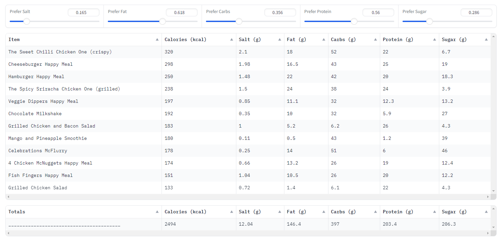

# McSolver - I'm Solvin' It


McSolver aims to solve the optimisation problem that is balancing macronutrients at McDonald's whilst staying
within the recommended daily calorie intake of 2500 kcal. 



## How to Run

1. Install the dependencies:
```bash
pip install -r requirements.txt
```

2. Run the application:
```bash
gradio mcapp.py
```
